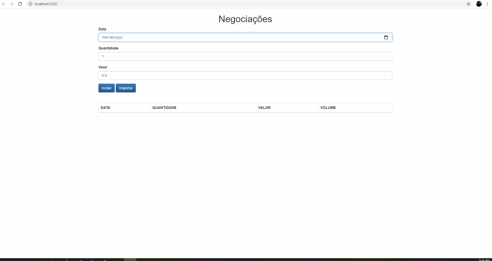

<h1>Transações</h1>

Este é um simples app em que simulamos Transações, com isso além de validarmos os campos proibimos o usuário de tentar operar fora de dias uteis!

O intuito deste projeto é introdução ao typescript:
    <ul>
        <li>Criação de Classes</li>
        <li>Criação de Interfaces</li>
        <li>Heranças</li>
        <li>Poliformismo</li>
        <li>Consumo de uma <a href="https://github.com/RicardinhoFilho/TransacoesAPI"> API</a></li>
    </ul>

    

    Como Utilizar: Após o clone do projeto rode em seu projeto <code>npm i</code>, este comando será reponsável por baixar todas as dependencias necessárias, após isso rode <code>npm start</code>, isso fará com que seu projeto se inicie na porta 3000!

